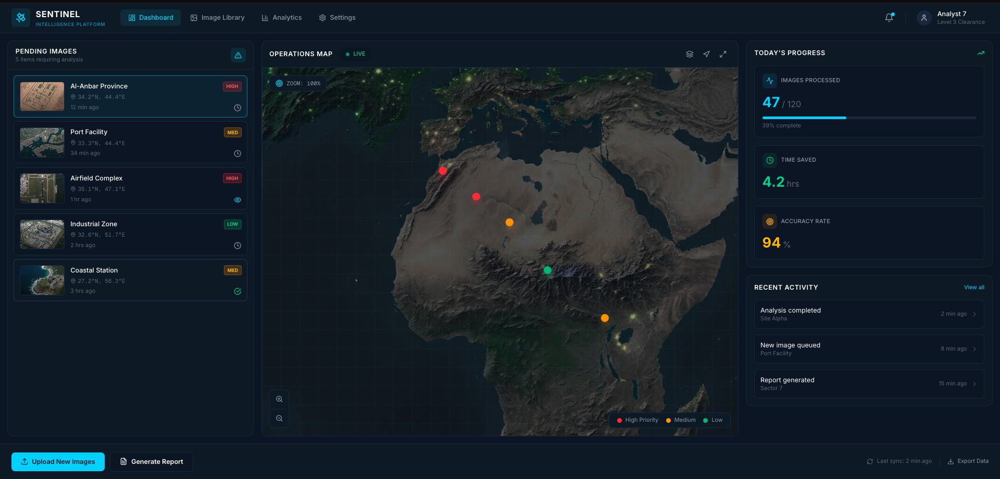
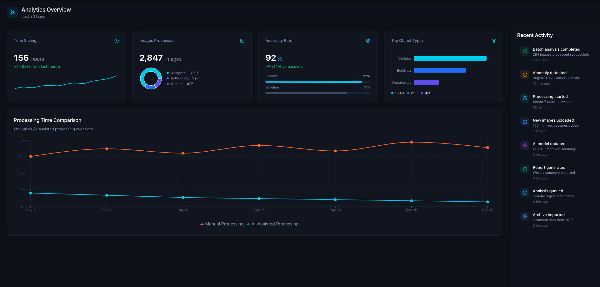

# Sentinel — AI-Powered ISR Analysis Platform

Satellite imagery analysis tool for defense intelligence analysts. Automates object detection and labeling in ISR imagery, reducing manual analysis time by hours per session.

## Problem

Intelligence analysts spend 6-8+ hours manually annotating objects in satellite imagery. Current workflows can't keep up with the volume of imagery being collected daily.

## Solution

AI-assisted detection pipeline that automates bulk labeling and surfaces priority targets, letting analysts review and correct instead of starting from scratch.

## Features

- Automated object detection and classification across satellite imagery
- Priority-based image queue (High / Medium / Low)
- Live operations map with geospatial tracking
- Real-time progress metrics (images processed, time saved, accuracy rate)
- Report generation and data export

## Status

Early-stage prototype. Solo-built as the foundation for **BLNK** — a defense-tech startup focused on AI-powered ISR analysis tools.
